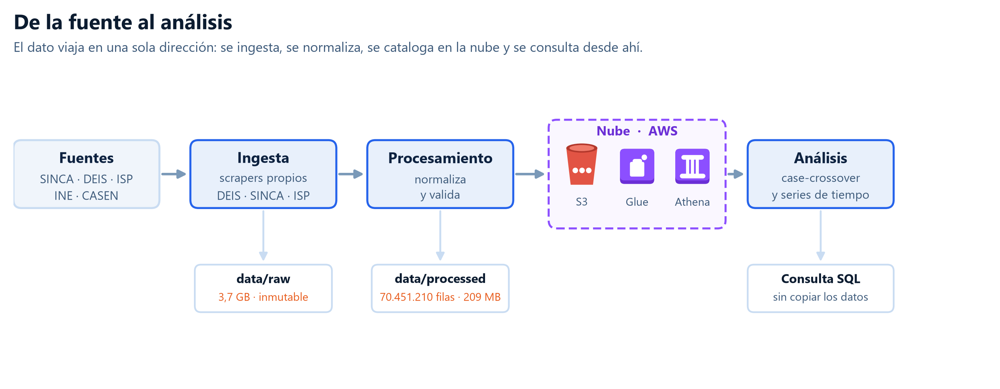
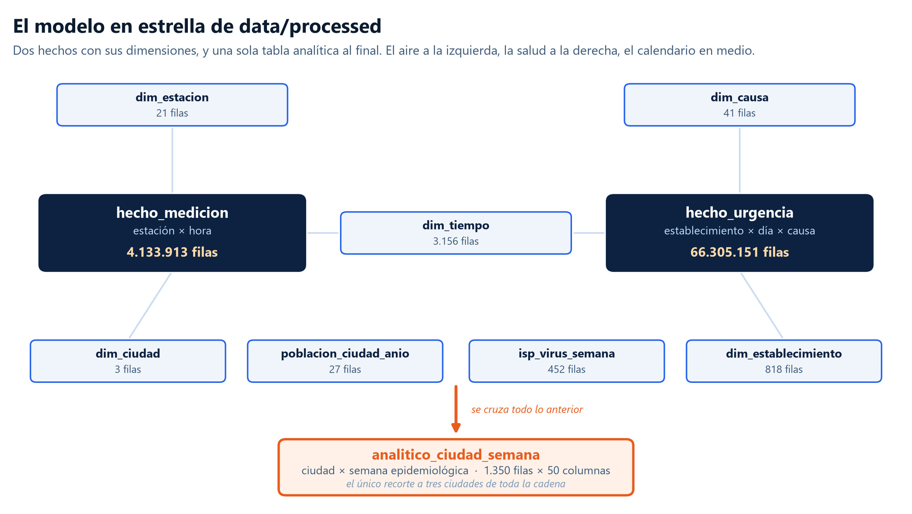
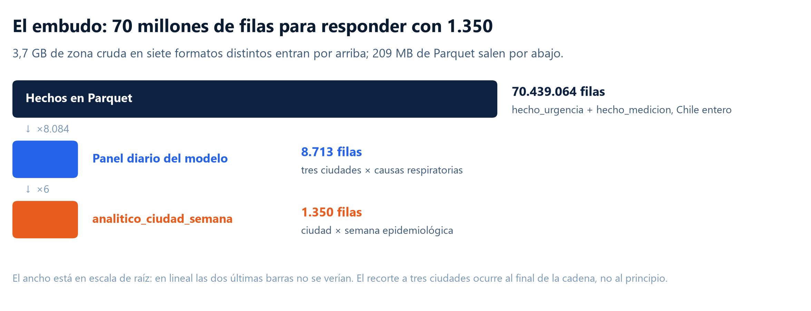
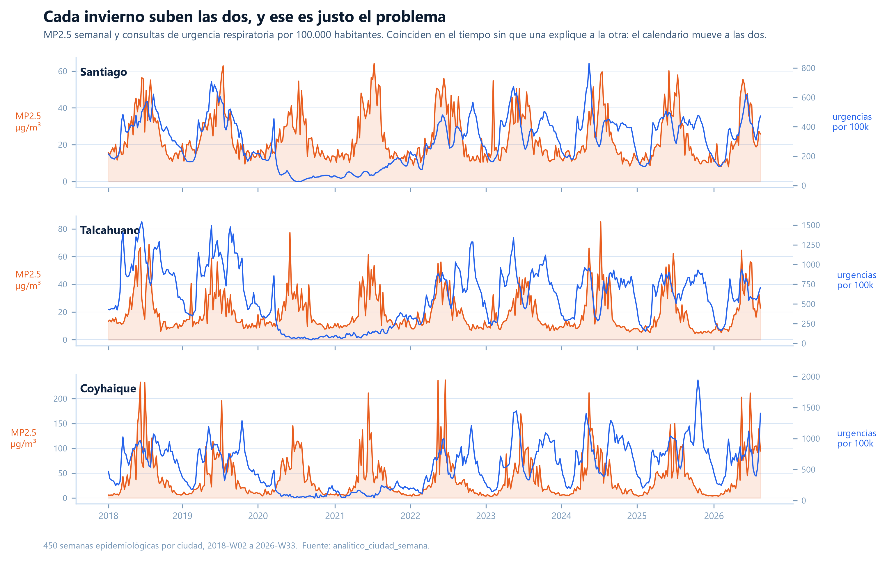
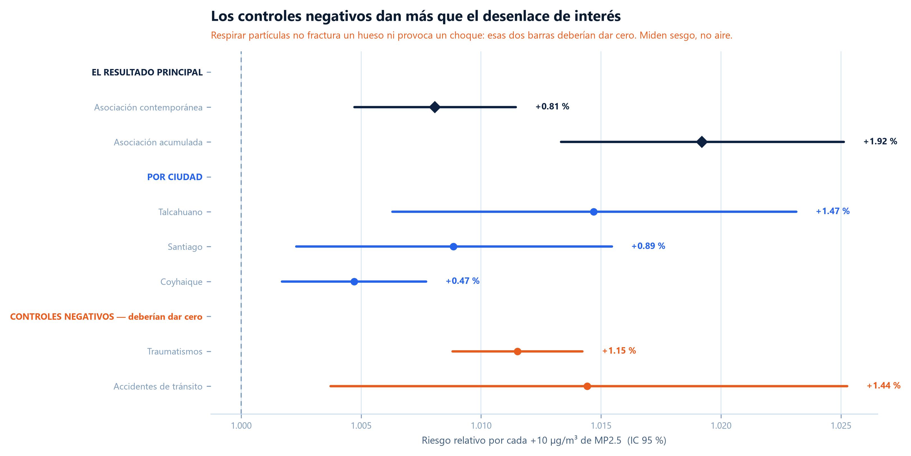
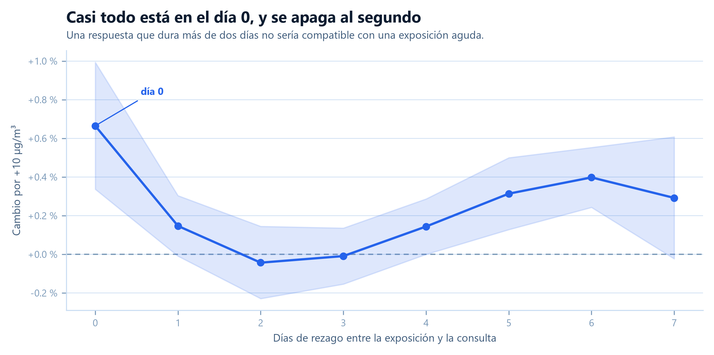

# Aire y Urgencias — MP2.5 y consultas de urgencia respiratoria en Santiago, Talcahuano y Coyhaique

**PARTICULAS CERO** · Pablo Rojas · Camila Bravo · Nicolás Torres · Noemi Calabuig · Dante Velasquez

> Informe final del proyecto capstone de Big Data. Se genera desde [`informe_final.md`](informe_final.md) con `python -m src.informe.markdown construir`; no se edita a mano.

## 1. Introducción

### 1.1. Información de Contexto

#### Prólogo

Cada invierno en Chile las salas de urgencia se saturan de pacientes con cuadros respiratorios agudos —bronquitis, neumonía, crisis obstructivas— al mismo tiempo que las ciudades se cubren de humo y esmog. Ante ese fenómeno surge una pregunta natural para cualquier ciudadano o tomador de decisiones:

**¿Las personas van a urgencias porque el aire está contaminado, o van simplemente porque hace frío y circulan virus de invierno?** ¿Hasta qué punto el material particulado fino incide, y hasta qué punto es solo un acompañante estacional?

Para responder con rigor, este estudio analizó millones de registros ambientales del SINCA y de atenciones médicas del DEIS (MINSAL) entre 2018 y 2026, en tres realidades geográficas opuestas de Chile.

#### Qué es el MP2.5 y qué es una estación de monitoreo

El **MP2.5** es material particulado fino: partículas en suspensión de menos de 2,5 micrómetros de diámetro, lo bastante pequeñas para atravesar las vías respiratorias superiores y llegar al pulmón profundo. Se mide en microgramos por metro cúbico de aire (µg/m³). Sus fuentes en Chile son la combustión residencial de leña, el tráfico vehicular y la actividad industrial.

Una **estación de monitoreo** es un punto fijo de medición de la red pública del SINCA (Sistema de Información Nacional de Calidad del Aire, del Ministerio del Medio Ambiente). Cada estación registra concentración de contaminantes hora a hora, y muchas registran además variables meteorológicas: temperatura, humedad, dirección y velocidad del viento. Son la única fuente oficial de medición de aire del país.

#### Por qué estas tres ciudades

La selección buscó cubrir realidades distintas y no la comodidad de los datos:

- **Gran Santiago** — la mayor concentración de población del país, más de 7 millones de habitantes en una cuenca encerrada por cordilleras, con esmog mixto: tráfico vehicular, industria e inversión térmica.
- **Talcahuano** — comuna portuaria e industrial **costera** (~158.000 habitantes), donde las fuentes industriales conviven con el viento y la brisa marina. Es una de las zonas más contaminadas del país.
- **Coyhaique** — ciudad intermedia patagónica (~62.000 habitantes) encajonada en un **valle** cordillerano austral, donde prácticamente toda la calefacción proviene de la combustión residencial de leña. Encabeza sistemáticamente los registros de MP2.5 de Chile.

Costa y valle, metrópolis y ciudad intermedia: el mismo contaminante con orígenes y condiciones de dispersión distintas.

#### El ámbito de cada ciudad

**Gran Santiago no es la Región Metropolitana entera.** Se acotó a las comunas urbanas cercanas entre sí y con mediciones disponibles en sus alrededores: las 32 comunas de la Provincia de Santiago, más San Bernardo (Provincia de Maipo) y Puente Alto (Provincia Cordillera). Quedan fuera provincias que sí tienen sensor pero están demasiado distantes de la urbe, como **Talagante**, a 35,7 km de Parque O'Higgins — más del doble que la siguiente estación más lejana.

| Ciudad | Región | Comunas | Población (INE) | Hogares con leña (CASEN) | Estaciones | MP2.5 medio 2024 | Días > 50 µg/m³ |
|---|---|---|---|---|---|---|---|
| Gran Santiago | Metropolitana | 34 | 7.247.920 | 3,6 % | 10 | 22,1 µg/m³ | 29 |
| Talcahuano | Biobío | 1 | 158.061 | 63,5 % | 4 | 20,5 µg/m³ | 34 |
| Coyhaique | Aysén | 1 | 62.318 | 82,5 % | 2 | 41,5 µg/m³ | 98 |

Las dos últimas columnas son una **fotografía de 2024**, tomada como año de referencia por ser el último con cobertura anual completa en las tres ciudades: son la media entre estaciones con al menos 300 días medidos. **El análisis usa la ventana completa, 2018 a 2026**; 2024 aparece aquí solo para poder comparar las tres ciudades en una misma cifra.

Coyhaique tiene menos de 63.000 habitantes y casi duplica la concentración media de Gran Santiago. En días sobre 50 µg/m³ la triplica.

Del lado de la salud, el DEIS publica las atenciones de urgencia por establecimiento, causa CIE-10 y **día**, sin huecos: cada año trae sus 365 o 366 días completos.

> [!IMPORTANT]
> **El DEIS es diario, y eso cambió el diseño**
>
> El alcance original hablaba de variación **semanal**. Al abrir los archivos y hacer un primer abordaje a los datos resultó que ambos lados soportan más resolución: el DEIS es diario y el SINCA es horario.
>
> La restricción semanal no venía de los datos, sino del supuesto con el que se partió y de la forma en que las fuentes se presentan. Terminó siendo la decisión más importante del proyecto (§2.5).

#### La cobertura de medición en Talcahuano

Talcahuano tiene **cuatro estaciones de MP2.5 con serie disponible**, y de ellas una publica datos con validación oficial del SINCA; las otras tres pertenecen a la red industrial y publican serie continua sin ese sello.

Eso no deja a la ciudad sin exposición medida: se comprobó que las tres series sin validar siguen a la validada con correlaciones de 0,82 a 0,93 —el mismo rango que dos estaciones validadas de Gran Santiago entre sí— y cargarlas multiplica por 4,2 las horas de MP2.5 disponibles. La decisión y su respaldo están en §2.4.

### 1.2. Motivación y Objetivo

> [!NOTE]
> **La pregunta**
>
> ¿Cómo **se asocia** la variación de MP2.5 con la variación de consultas de urgencia por causa respiratoria en Gran Santiago, Talcahuano y Coyhaique, controlando por temperatura y estacionalidad?
>
> Asociación, nunca causalidad: es un estudio ecológico observacional y ninguna fila describe a una persona.

#### Objetivo general

Construir una base de datos analítica reproducible que cruce mediciones de aire y atenciones de urgencia a escala de ciudad, y medir la asociación entre ambas series controlando por los factores que las mueven a la vez.

#### Objetivos específicos

- Reconocer la estructura real de cada fuente **antes** de escribir el código de ingesta definitivo.
- Ingerir a escala nacional, con validación previa a la carga, sobre una zona cruda inmutable.
- Normalizar en un modelo en estrella sobre Parquet, con cada decisión de limpieza documentada con su umbral.
- Publicar la base en la nube para que el equipo consulte sin copiar datos.
- Estimar la asociación **y sus límites**.
- Publicar los resultados en un sitio accesible sin credenciales.

#### Alcance del estudio

| Dimensión | Definición |
|---|---|
| Ciudades | Gran Santiago, Talcahuano y Coyhaique |
| Período | 2018-01-01 a 2026-08-22, el corte de datos disponible |
| Contaminante | MP2.5 |
| Unidad de análisis | ciudad-día en el modelo principal; ciudad-semana en el análisis de series |
| Rezagos | 0 a 7 días en el diseño diario; hasta dos semanas en el semanal |
| Controles | temperatura, humedad, estacionalidad y circulación viral |

El estudio es **ecológico y observacional**: compara agregados de ciudad, no personas. Puede medir si dos series se mueven juntas; no puede atribuir la consulta de un paciente concreto a la exposición de un día concreto.

### 1.3. Integrantes y Asignación de Roles

| Integrante | Rol |
|---|---|
| Pablo Rojas | Ingesta, procesamiento, nube y sitio |
| Camila Bravo | Apoyo en Diseño, Presentación y Análisis de datos |
| Nicolás Torres | Analiza los datos |
| Noemi Calabuig | Analiza los datos |
| Dante Velasquez | Gráficos temporales interactivos de MP2.5 y urgencias |

El análisis se trabajó junto al equipo de maneras independientes y luego colaborativas en notebooks: cada integrante desarrolló su línea por separado y los resultados se integraron después, contrastando los valores que aparecían en más de una entrega antes de publicarlos.

### 1.4. Cronograma e Hitos

El proyecto se ordenó por fuente: cada una se cierra antes de abrir la siguiente.

| Fecha | Hito |
|---|---|
| 2026-08-06 | Cierre del reconocimiento de fuentes · definición de las tres ciudades |
| 2026-08-13 | Reconocimiento de la fuente satelital y regla de valores centinela |
| 2026-08-26 | Conversión de los `.mdb` del DEIS · definición del ámbito de cada ciudad · corrección de coordenadas · regla sobre los estados de validación del SINCA |
| 2026-08-27 | Umbrales de cobertura · construcción de la tabla analítica ciudad-semana |
| 2026-08-30 | Primer despliegue del sitio en GitHub Pages |
| 2026-08-31 | Ingesta y procesamiento de la red nacional (84 estaciones de contexto) |
| 2026-09-01 | Rosa de contaminación desde el par horario MP2.5 + viento · escala ICAP |
| 2026-09-06 | Vigilancia viral del ISP en el catálogo · primera entrega del modelo diario |
| 2026-09-08 | Segunda entrega del modelo · integración del análisis semanal · reorganización de la página de análisis |
| 09/09/26 | Informe final |

## 2. Ejecución del Proyecto

### 2.1. Descripción del Escenario Simulado

Una **unidad de análisis de datos de salud ambiental** recibe un encargo: decir si la variación del MP2.5 se asocia con la variación de las consultas de urgencia respiratoria en tres ciudades representativas, y dejar montada la infraestructura para volver a hacer la pregunta con datos nuevos.

El encargo trae tres condiciones, y cada una decide una parte de la arquitectura:

| La condición | Lo que obliga |
|---|---|
| El resultado tiene que ser **auditable** | Zona cruda inmutable, y cada decisión de limpieza escrita con su umbral antes de aplicarse |
| El equipo trabaja en **máquinas distintas** | La base vive en la nube y se consulta dónde está, en vez de copiar 209 MB a cada portátil |
| El destinatario **no tiene credenciales** | Un sitio estático que lee agregados; una página que consultara Athena llevaría la llave escrita en su JavaScript |

La pregunta principal y el trabajo de modelado apuntan a resolver la pregunta de **asociación**. Sobre eso, y como cierre de los aprendizajes de patrones, se proyecta un **caso de negocio**: una simulación a futuro que, a partir de la proyección de consultas peak, estima la dotación de médicos, kinesiólogos y camas que requeriría cada ciudad en 2026, 2028 y 2030, en escenario base y severo.

### 2.2. Selección y Descripción de los Datasets

| **6** | **3,7 GB** | **7** | **51.101.314** |
|:---:|:---:|:---:|:---:|
| fuentes de datos | de zona cruda | formatos incompatibles | filas solo en el DEIS |

| Fuente | Rol en el estudio | Acceso | Volumen crudo |
|---|---|---|---|
| **SINCA** (MMA) | Fuente de aire: MP2.5 horario y meteorología | scraping propio y descarga por estación | 81 archivos de estación; 223 MB de red nacional |
| **DEIS** (MINSAL) | Co-primaria: urgencias por establecimiento, causa y día | scraping propio sobre Cognos | 1,8 GB (8,3 GB descomprimido) |
| **CIE-10** | Nomenclatura oficial de las causas de urgencia | diccionario oficial internacional | catálogo |
| **ISP** | Vigilancia de virus respiratorios: control del confusor | base construida por una integrante del equipo; se publica en su repositorio | reservada |
| **INE** | Proyecciones de población comunal: el denominador | XLSX | 11 MB |
| **CASEN** | Combustible de calefacción del hogar: contexto | microdatos `.dta` | 1,7 GB |

**Complementos del dashboard, no del análisis.** Dos fuentes alimentan la capa de contexto del sitio y no entran en el modelo: **Open-Meteo (ERA5)**, que aporta viento y temperatura actuales y rellena huecos meteorológicos, y **SatPM2.5 (ACAG)**, MP2.5 satelital mensual con papel espacial —permite ver si una estación representa a su comuna—, nunca temporal.

#### El dataset grande: DEIS

Producto cartesiano de establecimiento × causa × día, con los días sin atenciones registrados explícitamente como cero. Eso multiplica el volumen unas 40 veces respecto del dato con contenido, y es correcto: así la ausencia de fila no se confunde con un cero real.

| Año | Filas | Formato | Descomprimido |
|---|---|---|---|
| 2018 | 4.488.935 | Microsoft Access (`.mdb`) | 1,10 GB |
| 2019 | 4.550.877 | Microsoft Access (`.mdb`) | 1,11 GB |
| 2020 | 6.446.646 | CSV sin cabecera | 1,02 GB |
| 2021 | 8.816.240 | CSV | 1,04 GB |
| 2022 | 8.926.307 | CSV | 1,06 GB |
| 2023 | 8.899.080 | CSV | 1,49 GB |
| 2024 | 8.973.229 | CSV | 1,50 GB |
| **Total 2018-2024** | **51.101.314** |  | **≈ 8,3 GB** |

Tres características condicionaron todo lo que vino después:

- **El formato cambia entre años.** Sin el driver ODBC de Access, 2018 y 2019 son ilegibles y el período se reduce a 2020-2024: justo los años afectados por la pandemia.
- **El esquema tampoco es estable**, y el identificador de establecimiento no es una clave estable entre años.
- **El archivo trae valores derivados** que, sumados junto con sus componentes, producirían errores silenciosos de factor 2 y factor 60.

#### Los estados de validación del SINCA

El SINCA entrega cada medición en una de tres columnas excluyentes —validados, preliminares, no validados— y esa información no existe en ninguna otra fuente del proyecto. Se verificó sobre los 19 archivos de MP2.5 que la exclusividad es real: cero filas con valor en más de una columna, cero pares (fecha, hora) repetidos.

Hay dos regímenes. Las 15 estaciones con dato de Gran Santiago y Coyhaique, más la estación validada de Talcahuano, tienen 93-99 % de dato validado. Las tres estaciones industriales de Talcahuano acumulan 355.101 mediciones en régimen continuo sin sello de validación.

### 2.3. Pipeline de Ingesta de Datos

La ingesta se resolvió con **scrapers propios**, desarrollados por el equipo y de uso interno, uno por fuente. Escriben en `data/raw/`, que es inmutable, y el dato **se valida previamente a ser subido**.

| Fuente | Mecanismo | Detalle |
|---|---|---|
| **DEIS** | Scraping sobre **Cognos** | Los archivos anuales de atenciones de urgencia se publican a través de la plataforma de reportería del MINSAL. El scraper recorre la publicación por año y descarga el paquete completo, sin filtrar por comuna |
| **SINCA — meteorología** | Scraping sobre el sistema de consulta | Temperatura, humedad, dirección y velocidad del viento, por estación y año, en el mismo patrón de petición que la serie de aire |
| **SINCA — MP2.5** | **Descarga manual** en las tres ciudades | Es el dato central del estudio y son pocas estaciones: se bajó estación por estación y se verificó una por una antes de incorporarla |
| **ISP** | Base propia del equipo | Serie de vigilancia viral construida por una integrante a partir de los informes semanales del ISP. **Reservada:** se publica primero en su propio repositorio |
| **CIE-10** | Diccionario oficial | La nomenclatura que define qué causas son respiratorias viene del catálogo internacional, no se infiere de los nombres del archivo |
| **INE · CASEN** | Descarga directa | Proyecciones de población y microdatos de la encuesta |

> [!NOTE]
> **La ingesta es nacional; el recorte viene al final**
>
> Ningún scraper filtra por las tres ciudades. El DEIS se descarga entero —los siete años de Chile completo— y la red del SINCA se recorre por estación de todas las regiones.
>
> El filtro a Gran Santiago, Talcahuano y Coyhaique ocurre una sola vez, en la última tabla del procesamiento. Recortar en la ingesta habría dejado al proyecto sin la escala que justifica tratarlo como un problema de Big Data, y habría hecho imposible el contexto nacional del mapa.

#### Qué se valida antes de cargar

Cada archivo pasa cuatro comprobaciones antes de entrar a la zona cruda: tamaño mayor que cero, tipo de contenido esperado, parseable en el formato declarado, y número de filas dentro de un rango plausible para esa fuente y ese año. El que no pasa queda registrado como error y se vuelve a pedir.

### 2.4. Procesamiento de Transformación de Datos

El procesamiento lee la zona cruda y escribe Parquet particionado por año. Los lectores **normalizan por detección y no por supuesto**: el DEIS trae cabeceras distintas por año, y un lector único aplicado a ciegas produciría columnas desplazadas sin avisar.



*La cadena completa. El dato viaja en una sola dirección y el recorte a tres ciudades ocurre una única vez, al final.*



*El modelo en estrella, con las filas que tiene hoy cada tabla.*

#### Las tablas construidas

| Tabla | Grano | Filas |
|---|---|---|
| `hecho_medicion` | estación × hora, con el estado de validación | 4.133.913 |
| `hecho_urgencia` | establecimiento × día × causa | 66.305.151 |
| `dim_tiempo` | día, con semana epidemiológica e invierno | 3.156 |
| `dim_estacion` | estación del SINCA | 21 |
| `dim_ciudad` | qué comunas forman cada ciudad | 3 |
| `dim_causa` | catálogo CIE-10 de causas | 41 |
| `dim_establecimiento` | catálogo de establecimientos | 818 |
| `poblacion_comuna_anio` | denominador por comuna y franja etaria | 3.114 |
| `poblacion_ciudad_anio` | denominador por ciudad | 27 |
| vigilancia viral (2 tablas, reservadas) | circulación viral: control del confusor | — |
| `analitico_ciudad_semana` | **ciudad × semana epidemiológica** | 1.350 |
| `red_nacional_estacion` · `_mes` · `_anio` · `_rosa` | contexto del mapa | 101 · 9.243 · 834 · 640 |

En total, **70.462.028 filas en 209 MB de Parquet**, repartidas en 16 prefijos de `data/processed/`. De ellos, las cuatro tablas de red nacional alimentan el mapa y se construyen en local, sin pasar por la nube.

La base `aire_urgencias` de Athena tiene hoy **14 tablas**: las **12 del modelo** —once de la capa plata y una de oro— más **dos restos de consultas `CREATE TABLE AS SELECT`** hechas durante el análisis (`hecho_medicion_temp` y `panel_diario_mp25`), que viven en el directorio de resultados de Athena y no en la zona `processed/`. Se dejan registradas por transparencia; no forman parte del modelo. El detalle está en el anexo `docs/informe/anexos/athena_ddl.md`.

**Zona cruda medida hoy: 3,7 GB.** El desglose por fuente: DEIS 1,8 GB, CASEN 1,7 GB, SINCA 223 MB, satelital 99 MB, INE 11 MB, ISP y el resto por debajo de 5 MB. Si se cuentan además los intermedios de limpieza —regenerables, y que no viajan a la nube— la huella en disco sube a **8,3 GB**.



*De 70 millones de filas a las 1.350 con las que se responde la pregunta.*

#### Decisiones de transformación, con su umbral

- **Cobertura en tres escalones**, descartando antes de promediar: un día vale con ≥ 18 de 24 horas; una semana de estación con ≥ 5 de 7 días; una semana de ciudad con ≥ 1 estación válida. Medido, el umbral no cuesta ni una semana de MP2.5: las 1.350 filas tienen exposición.
- **MP2.5 de ciudad = media de las medias por estación**, no media agrupada de horas: la agrupada pondera por accidentes de mantenimiento, con hasta 10,3 µg/m³ de diferencia. La otra versión se guarda aparte para poder medir esa sensibilidad.
- **Los tres estados de validación se cargan como dato válido**, y la columna se conserva para que la decisión sea reversible con una cláusula `WHERE`. El respaldo empírico está en §1.1; el contraste pendiente, en §4.2.
- **Talagante queda fuera de Gran Santiago.** La estación no se borra: queda en la dimensión, sin ciudad asignada y con una nota que dice por qué.

> [!WARNING]
> **La semana epidemiológica no es la semana ISO**
>
> La referencia temporal del estudio es la **Semana Epidemiológica del Ministerio de Salud**, que es la que usa el DEIS para numerar sus registros.
>
> Las funciones de calendario ISO que traen los lenguajes por defecto —`isocalendar()`, `strftime('%V')`— **desfasan hasta seis días** contra esa numeración: del mismo orden de magnitud que el efecto que se busca medir, y por tanto capaz de inventarlo o de borrarlo.
>
> Por eso la numeración se construye explícitamente y se contrasta fila a fila contra la del propio DEIS; el proceso se detiene si no coinciden al 100 %.

#### Hadoop y Spark

El trabajo de Spark corre **fuera del repositorio**, en la VM de Hadoop (~8 GB de RAM), sobre HDFS y con su propio intérprete:

```
spark-submit --master yarn --deploy-mode client \
    --driver-memory 1g --executor-memory 2g --num-executors 2 \
    spark_grano_fino.py \
    hdfs:///user/$USER/aire/processed hdfs:///user/$USER/aire/trabajo
```

Produce dos salidas al grano fino y **ninguna agregada por ciudad, a propósito**: urgencias por establecimiento-día y aire por estación-día. Entre estaciones de Gran Santiago, en la misma semana de invierno, hay diferencias de hasta 61 µg/m³; promediarlas en esta etapa dejaría esa variación fuera del alcance del análisis para siempre. El promedio, el radio y la ponderación son decisiones de análisis y pertenecen a la consulta.

El mismo pipeline está replicado en PySpark sobre Google Colab.

### 2.5. Consulta de Datos e Insights

#### Athena es la base de datos

Nadie sincroniza los datos procesados para consultar. El catálogo de Glue guarda dónde está cada Parquet en S3 y Athena lo lee desde ahí: los datos no se copian a ninguna parte.

El DDL **no se escribe a mano** — se genera leyendo el esquema real del Parquet. Un `bigint` declarado donde el archivo trae `double` no falla al crear la tabla: falla al consultarla.

```
from src.nube.consultar import consultar
df = consultar("SELECT * FROM analitico_ciudad_semana")
```

Athena cobra por byte escaneado, 5 USD por TB. La consulta que cruza las siete tablas principales escanea ~114 MB: 0,0006 USD. Pero un `SELECT *` sobre `hecho_urgencia` sin filtro escanea los 187 MB completos — **filtrar por `anio` usa la partición** y evita leer los años que no se piden.

#### Lo primero que se ve: las dos series suben juntas



*MP2.5 semanal y urgencias respiratorias por 100.000 habitantes, 2018-2026. Se ve el ciclo de invierno, y se ve el hundimiento de la consulta durante la pandemia.*

Y ahí está el problema entero del estudio: coinciden en el tiempo sin que una tenga que explicar a la otra. El MP2.5 sube por calefacción e inversión térmica; las urgencias, por frío y circulación viral. **El calendario mueve a las dos.**

> [!IMPORTANT]
> **El hallazgo principal es metodológico: la resolución decidía el resultado**
>
> A escala **semanal**, con descuento estacional simple y sin control viral, la asociación no se distingue de cero. Al descontar la estación del año la correlación se desploma, y la prueba de precedencia temporal no encuentra señal en Gran Santiago ni en Talcahuano.
>
> A escala **diaria**, comparando cada ciudad consigo misma dentro del mismo mes y día de la semana, la asociación aparece.
>
> Los dos análisis se hicieron por caminos independientes y no se contradicen: son preguntas distintas a resoluciones distintas. Que ambas lleguen ahí es el aporte más sólido del trabajo, más que cualquiera de los coeficientes.

#### La asociación diaria, y su tamaño

Case-crossover estratificado por tiempo, Poisson condicional sobre conteos diarios, estratos de ciudad × año × mes × día de la semana, con ajuste por temperatura (spline natural), humedad y actividad viral del ISP. Los intervalos vienen escalados por la sobredispersión cuasi-Poisson, lo que se comprobó contra los propios números y no se dio por supuesto.

| Análisis | RR por +10 µg/m³ | IC 95 % |
|---|---|---|
| Asociación contemporánea (mismo día) | 1,00808 | 1,00472 – 1,01145 |
| Asociación acumulada (rezagos 0-7) | 1,01921 | 1,01333 – 1,02512 |

| Ciudad | RR | IC 95 % | Casos | Días-ciudad |
|---|---|---|---|---|
| Talcahuano | 1,01469 | 1,00631 – 1,02314 | 334.472 | 2.781 |
| Gran Santiago | 1,00885 | 1,00230 – 1,01545 | 8.211.367 | 2.911 |
| Coyhaique | 1,00471 | 1,00170 – 1,00771 | 145.200 | 3.021 |

Coyhaique tiene el intervalo más angosto pese a aportar 145.200 consultas frente a los 8,2 millones de Gran Santiago. No es una anomalía: su MP2.5 varía muchísimo más, y más contraste por día es más información por caso.

#### El MP2.5 aporta poco al predecir urgencias

En la ablación del análisis semanal, comparando **a modelo fijo**, el aporte del MP2.5 al R² va de **−0,050 a +0,019**, y el máximo está en Coyhaique. La importancia relativa lo dice igual: la inercia de la propia serie pesa 88-94 %, el clima 4-7 % y el MP2.5 entre 1,6 % (Gran Santiago) y 5,3 % (Coyhaique).

Ese resultado es el que mantiene la proyección como un cierre de patrones y no como el resultado del estudio: si el MP2.5 fuera el motor de las urgencias, se habría notado al intentar predecirlas.

## 3. Resultados

### 3.1. Scripts y Código de Ingesta de Datos

La obtención final de los datos se hizo con **scrapers desarrollados por el equipo**, uno por fuente oficial. No están publicados: son de uso interno del equipo y apuntan a plataformas públicas cuyo patrón de consulta no está documentado.

| Scraper | Fuente oficial | Qué obtiene |
|---|---|---|
| **Scraper DEIS** | Plataforma **Cognos** del MINSAL | Los paquetes anuales de atenciones de urgencia, Chile completo, 2018-2026 |
| **Scraper SINCA** | Sistema de consulta del SINCA (MMA) | Series horarias de meteorología por estación y año; el MP2.5 de las tres ciudades se bajó de forma manual y verificada |
| **Vigilancia viral** | Informes semanales del ISP | Base construida por una integrante del equipo. **Reservada** hasta que ella la publique en su repositorio |

El resto de las fuentes —CIE-10, INE y CASEN— son descargas directas de archivos publicados, sin scraping.

El procesamiento posterior sí vive en el repositorio y se ejecuta como módulos:

```
uv run python -m src.procesamiento.deis_access convertir   # 2018-2019: .mdb -> CSV
uv run python -m src.procesamiento.deis construir
uv run python -m src.procesamiento.sinca construir
```

### 3.2. Scripts y Código de Transformación de Datos

Dos convenciones se repiten en todo el paquete: **`construir` escribe** y **`verificar` relee lo escrito sin recalcular**. Separarlas es lo que impide que una verificación pase por casualidad reproduciendo el mismo error.

```
uv run python -m src.procesamiento.tiempo construir
uv run python -m src.procesamiento.tiempo validar          # semana epidemiológica
uv run python -m src.procesamiento.estaciones construir
uv run python -m src.procesamiento.ciudades construir
uv run python -m src.procesamiento.poblacion construir
uv run python -m src.procesamiento.analitico construir     # recorte a 3 ciudades
```

| Módulo | Qué transforma |
|---|---|
| `deis_access.py` | `.mdb` de Access (1,1 GB) a CSV con una cabecera única, para que un solo lector sirva para los nueve años |
| `deis.py` | `hecho_urgencia`, `dim_causa`, `dim_establecimiento` |
| `sinca.py` | `hecho_medicion` con los tres estados de validación |
| `tiempo.py` | `dim_tiempo` con la semana epidemiológica del MINSAL |
| `estaciones.py` | `dim_estacion`, con las correcciones aplicadas en código y su evidencia al lado |
| `geografia.py` | La única definición de qué comunas forman cada ciudad |
| `ciudades.py` | `dim_ciudad`; audita el lado aire contra el lado salud y falla si discrepan |
| `poblacion.py` | El denominador por comuna, ciudad, año y franja etaria |
| `isp_virus.py` | **Reservado.** La base de vigilancia viral es de una integrante del equipo y se publica primero en su repositorio |
| `analitico.py` | La tabla ciudad-semana: el único recorte a tres ciudades |

> [!NOTE]
> **Por qué la definición de ciudad vive en un solo módulo**
>
> Una ciudad no existe en los datos: existe dos veces y por separado. Del lado de la salud es un conjunto de **comunas**; del lado del aire, un conjunto de **estaciones**.
>
> Si los dos conjuntos no describen el mismo territorio, el estudio correlaciona el MP2.5 de un sitio con las urgencias de otro. El resultado sale igual, se grafica igual, y no hay nada en él que lo delate.
>
> Por eso la pertenencia se decide en un solo módulo, por código de comuna, y el proceso falla si las dos definiciones discrepan.

#### Las capas, y el DDL que las creó

El proyecto no bautizó sus tablas con la nomenclatura medallion, pero la estructura es esa:

| Capa | Qué es | Dónde vive |
|---|---|---|
| **Bronce** | Los archivos tal como los entregó cada organismo | `data/raw/`, inmutable. No pasa por Athena |
| **Plata** | El modelo en estrella: los dos hechos, las cinco dimensiones, el denominador de población y la vigilancia viral | Parquet en S3, catalogado en Glue: **11 tablas externas** |
| **Oro** | La tabla analítica ciudad-semana, ya recortada a las tres ciudades | Parquet en S3, catalogado en Glue: **1 tabla** |

La base se creó primero, y su ubicación es el propio prefijo `processed/` del bucket:

```
CREATE DATABASE IF NOT EXISTS aire_urgencias
  COMMENT 'Modelo estrella MP2.5 x urgencias respiratorias 2018 - 2026'
  LOCATION 's3://aire-urgencias-2026-pr/processed/'
```

Sobre ella, once `CREATE EXTERNAL TABLE` levantan la capa plata. Este es el patrón —una tabla externa sobre un prefijo de S3, particionada por año:

```
CREATE EXTERNAL TABLE IF NOT EXISTS aire_urgencias.hecho_medicion (
    estacion_id int,
    ciudad_id string,
    fecha date,
    hora int,
    parametro_id string,
    valor double,
    estado_validacion string)
PARTITIONED BY (anio int)
STORED AS PARQUET
LOCATION 's3://aire-urgencias-2026-pr/processed/hecho_medicion/'
```

> [!NOTE]
> **El DDL no se transcribió: se bajó del historial**
>
> El anexo **`docs/informe/anexos/athena_ddl.md`** lleva el DDL completo y vigente de las 14 tablas, extraído de las 633 ejecuciones que Athena guarda en el historial del workgroup `primary`.
>
> De cada objeto se anexa la última ejecución con éxito, que es la que manda: el catálogo se reconstruyó varias veces y las versiones intermedias ya no describen lo que hay en la base.
>
> Se regenera con `python -m src.nube.historial ddl`. Escribir ese DDL a mano habría sido transcribirlo, y un DDL transcrito no se puede auditar sin volver a compararlo a ojo contra la consola.

### 3.3. Descripción y Muestra de los Datasets Transformados

#### La capa oro

Es una sola tabla, `analitico_ciudad_semana`: 50 columnas que cruzan exposición, meteorología, urgencias por causa y franja etaria, denominador de población y circulación viral, ya al grano ciudad-semana y ya recortadas a las tres ciudades.

```
CREATE EXTERNAL TABLE IF NOT EXISTS aire_urgencias.analitico_ciudad_semana (
    ciudad_id string,
    ciudad string,
    semana_id string,
    anio_epi bigint,
    semana_epi bigint,
    inicio_semana date,
    fin_semana date,
    mp25_media double,
    mp25_media_lag1 double,
    mp25_media_lag2 double,
    temp_media double,
    urg_resp bigint,
    poblacion bigint,
    tasa_resp_100k double,
    ...)
STORED AS PARQUET
LOCATION 's3://aire-urgencias-2026-pr/processed/analitico_ciudad_semana/'
```

El DDL íntegro de las 50 columnas, junto con el de las once tablas de plata y el de las dos tablas materializadas fuera del modelo, está en el anexo **`docs/informe/anexos/athena_ddl.md`**.

#### `analitico_ciudad_semana` — la tabla del análisis

Grano ciudad × semana epidemiológica, 1.350 filas y 50 columnas. Dos semanas de invierno de 2023, tal como están en el Parquet:

| ciudad | semana | mp25_media | est. | días | temp_media | urg_resp | urg_totales | población | tasa_resp_100k |
|---|---|---|---|---|---|---|---|---|---|
| coyhaique | 2023-W26 | 145,03 | 2 | 7 | 1,53 | 388 | 1.437 | 61.885 | 626,97 |
| coyhaique | 2023-W27 | 64,99 | 2 | 7 | 1,54 | 294 | 1.320 | 61.885 | 475,07 |
| santiago | 2023-W26 | 36,69 | 9 | 7 | 10,51 | 24.540 | 78.504 | 7.153.397 | 343,05 |
| santiago | 2023-W27 | 35,66 | 9 | 7 | 8,80 | 20.126 | 70.385 | 7.153.397 | 281,35 |
| talcahuano | 2023-W26 | 43,23 | 4 | 7 | 11,50 | 863 | 4.132 | 158.222 | 545,44 |
| talcahuano | 2023-W27 | 32,64 | 4 | 7 | 11,15 | 732 | 3.799 | 158.222 | 462,64 |

145 µg/m³ de media **semanal** en Coyhaique. Esa fila explica por qué esa ciudad domina el contraste de exposición del estudio pese a ser la más pequeña.

#### `hecho_medicion` — estación × hora

4.133.913 filas, 8 columnas, particionada por año:

| estacion_id | ciudad_id | fecha | hora | parametro_id | valor | estado_validacion | anio |
|---|---|---|---|---|---|---|---|
| 228 | santiago | 2018-01-01 | 0 | vel_viento | 1,674590 | sin_estado | 2018 |
| 228 | santiago | 2018-01-01 | 1 | vel_viento | 1,075720 | sin_estado | 2018 |
| 228 | santiago | 2018-01-01 | 2 | vel_viento | 1,041110 | sin_estado | 2018 |

`sin_estado` es la meteorología, que el SINCA entrega sin columnas de validación. El MP2.5 trae `validado`, `preliminar` o `no_validado`, y esa columna se conserva precisamente para que la decisión de §2.4 sea reversible con una cláusula `WHERE`.

#### `hecho_urgencia` — establecimiento × día × causa

66.305.151 filas, 13 columnas, franjas etarias en columnas:

| establecimiento_id | fecha | semana_deis | causa_id | tipo_atencion | total | menores_1 | de_1_a_4 | de_5_a_14 | de_15_a_64 | de_65_y_mas |
|---|---|---|---|---|---|---|---|---|---|---|
| 18-826 | 2018-01-01 | 1 | 12 | Indiferenciado | 0 | 0 | 0 | 0 | 0 | 0 |
| 18-826 | 2018-01-04 | 1 | 12 | Indiferenciado | 1 | 0 | 0 | 0 | 0 | 1 |

Las filas en cero vienen así del DEIS y son deliberadas: el archivo registra los días sin atenciones de una causa para que ausencia de fila no se confunda con cero. Son la razón de que la tabla tenga 66 millones de filas.

### 3.4. Visualización de Datos de los Resultados de Consulta

El resultado publicable es un sitio estático en GitHub Pages con tres páginas: el **mapa de la red** —100 estaciones, las 16 del estudio con meteograma, rosa de contaminación y tabla año por año, más las 84 de contexto nacional—, el **análisis** en siete capítulos ordenados de lo más simple a lo más técnico, y la **metodología**.

No tiene backend. Lee agregados de unos 900 kB, sin ningún registro individual, y el 100 % de sus gráficos son cadenas de SVG construidas en JavaScript con los colores escritos como variables CSS — que es lo que hace que el modo oscuro funcione sin repintar nada.

#### El resultado, y la prueba que acota su lectura



*Estimaciones del modelo diario con sus intervalos. Las dos barras naranjas son controles negativos: deberían dar cero.*

> [!CAUTION]
> **Los controles negativos no dieron nulos**
>
> Un control negativo es un desenlace que la exposición no puede provocar: respirar partículas no fractura un hueso ni provoca un choque. Traumatismos (4.348.004 casos) da **+1,15 %** y accidentes de tránsito **+1,44 %**, mientras el desenlace de interés da +0,81 %.
>
> Dan **más** que aquello que se quiere medir, así que miden sesgo, no aire.
>
> La explicación más plausible es meteorológica: los días de alto MP2.5 son días de inversión térmica —fríos, sin viento, con niebla— y ese patrón produce caídas y choques por vías que no pasan por los pulmones. El ajuste por temperatura media diaria no captura hielo en el suelo ni visibilidad.
>
> **Consecuencia:** el estudio no puede presentar el 1,0192 acumulado como un resultado limpio, porque no se puede separar cuánto de él es aire.



*La forma de la respuesta en el tiempo.*

#### La escalera de ajuste

Cada control que entra se lleva una parte de lo que parecía asociación:

| Especificación | RR | IC 95 % |
|---|---|---|
| Base | 1,0179 | 1,0142 – 1,0215 |
| + Temperatura | 1,0188 | 1,0152 – 1,0224 |
| + Humedad | 1,0125 | 1,0089 – 1,0161 |
| + Actividad viral (ISP) | 1,00808 | 1,00472 – 1,01145 |

Las diferencias entre grupos etarios, zonas o diagnósticos que publica el sitio son **descriptivas y no equivalen a una prueba formal de interacción**: la página muestra las estimaciones y dice cuáles cruzan el cero, pero no afirma que la asociación sea mayor en un grupo que en otro.

#### Precedencia semanal

Prueba de precedencia temporal de Granger sobre las series diferenciadas: lo que mide es si el pasado de una serie mejora la predicción de otra.

| Ciudad | rezago 1 | rezago 2 | rezago 3 | rezago 4 |
|---|---|---|---|---|
| Gran Santiago | 0,6012 | 0,8086 | 0,9778 | 0,9959 |
| Talcahuano | 0,9297 | 0,3484 | 0,2799 | 0,3833 |
| Coyhaique | 0,4166 | 0,0577 | **0,0090** | **0,0269** |

Coyhaique es la única ciudad donde el MP2.5 de semanas previas precede a las consultas. Es coherente con el resto: es la ciudad con más contraste de exposición y donde la calefacción a leña es prácticamente universal.

## 4. Impacto Proyectado

### 4.1. Logros y Beneficios

| **70,5 M** | **13.105** | **15** | **0** |
|:---:|:---:|:---:|:---:|
| filas procesadas | líneas de Python | decisiones documentadas | credenciales en el repositorio |

#### Lo que quedó construido

- Una cadena de cinco etapas en la que el dato viaja en una sola dirección y cada frontera está justificada.
- 70,5 millones de filas en Parquet (209 MB) desde 3,7 GB de zona cruda, consultables por SQL desde Athena sin que nadie copie datos a su máquina.
- Quince documentos de decisiones de limpieza, cada uno con su umbral, su justificación, qué se pierde y qué alternativas se descartaron.
- Un sitio público que se despliega de manera **accesible, rápida y eficiente**, y que se niega a publicar si le falta un dato.

#### Lo que se ganó por hacerlo así

- **Todo resultado es rastreable hasta el archivo original.** La zona cruda no se edita jamás; las correcciones viven en código y con su evidencia al lado.
- **Una sola definición de cada cosa.** Qué comunas forman una ciudad, qué causas son respiratorias y cómo se numera una semana se deciden en un único sitio, y el proceso falla si dos partes discrepan.
- **El resultado honesto se publicó.** Los controles negativos están en el sitio y en este informe: llegamos a que nuestra hipótesis de asociación **no se sostiene de forma limpia con esta metodología**, y decirlo es parte del resultado.

> [!IMPORTANT]
> **Si hay que quedarse con una sola frase**
>
> La resolución temporal decidía el resultado. A escala semanal la asociación no se distingue de cero; a escala diaria, comparando dentro del mismo mes y día de semana, aparece. Y los controles negativos avisan de que ni siquiera esa versión está limpia.
>
> Un estudio que solo hubiera corrido una de las dos resoluciones habría publicado una conclusión sin tener cómo saber que era la conclusión de su resolución.

### 4.2. Mejoras Futuras

#### Lo que quedó deliberadamente fuera de este estudio

Estas líneas no se abordaron y son la extensión natural del trabajo: causalidad · inferencia individual · aplicación para ciudadanos · otros contaminantes · atribución de fuentes · cobertura nacional · valorización económica · mortalidad · datos clínicos individuales.

#### Mejoras de metodología

1. **Contrastar el resultado restringiendo a dato con validación oficial.** La decisión de cargar los tres estados de validación se tomó por conveniencia y afecta sobre todo a Talcahuano. Esto depende de la realidad de los datos y de estaciones del SINCA sin revisión constante: si el coeficiente cambia al restringir, el resultado depende de esa decisión y hay que decirlo; si no cambia, también.
2. **Incorporar el viento al diseño case-crossover**, considerando el impacto del movimiento del material particulado sobre los individuos afectados por el flujo de contaminación, en vez de tratar la exposición como un promedio inmóvil de ciudad.
3. **Agregar factores meteorológicos que hoy faltan**, en particular las **precipitaciones**, a las que no se tuvo acceso en todas las estaciones del SINCA pero que sí se pueden extraer de otra fuente de acceso público.
4. **Análisis punto a punto en vez de promedio de ciudad**, considerando efectos por cercanía entre estaciones de medición y centros médicos. Es la generalización del problema de ámbito espacial que aparece en cada ciudad: promediar toda una urbe asigna a un establecimiento una exposición que puede no ser la suya.
5. **Probar formas funcionales alternativas para los controles**, en particular tratar la actividad viral con la misma flexibilidad que se le da a la temperatura, en lugar de como término lineal.
6. **Ampliar la densidad de puntos de medición con datos abiertos**, del tipo PurpleAir, que ofrecen mayor variedad de puntos y la posibilidad de contar con información *in-door* y no solo *out-door*. Serían consideraciones extra, fuera de los accesos estatales nacionales de datos abiertos.
